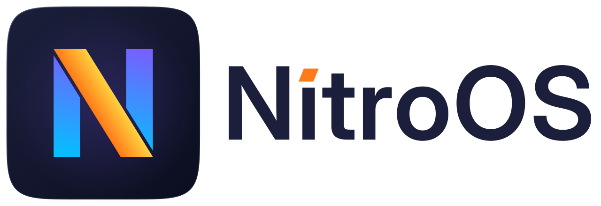
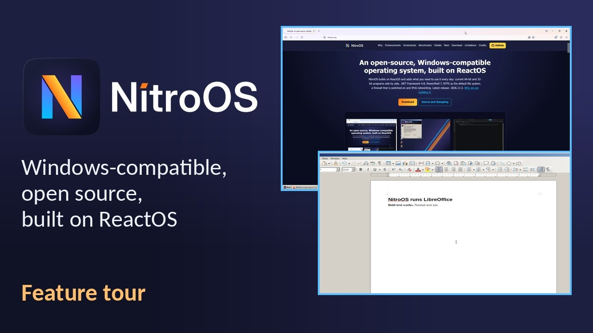
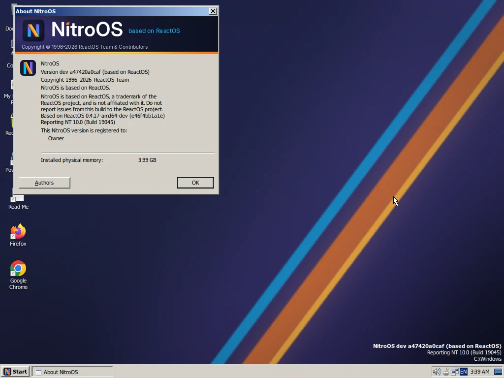
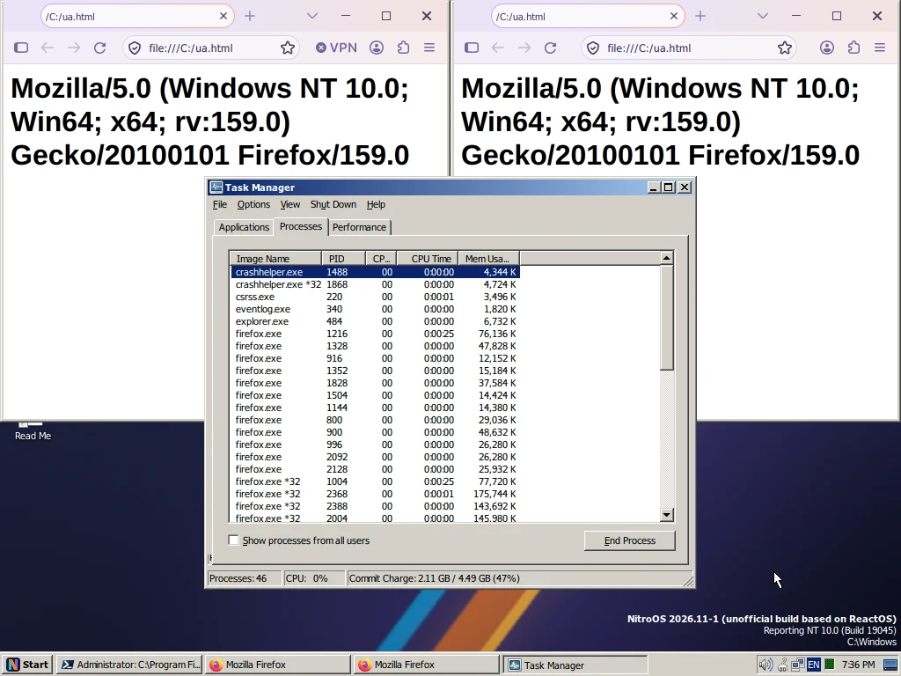

<p align="center">
  <picture>
    <source media="(prefers-color-scheme: dark)" srcset="docs/img/brand/lockup-1280.png">
    
  </picture>
</p>

<div align="center">

### An open-source, Windows-compatible operating system, built on ReactOS

[](https://github.com/nitroos-org/releases/releases/latest)
[](#download)
[](https://github.com/nitroos-org/reactos)
[](#licence)

[Website](https://nitroos.org) ·
[Download](#download) ·
[Quick start](#quick-start) ·
[Features](FEATURES.md) ·
[Screenshots](SCREENSHOTS.md) ·
[Videos](https://nitroos.org/#videos) ·
[Changelog](CHANGELOG.md) ·
[Benchmarks](BENCHMARKS.md)

</div>

> [!IMPORTANT]
> NitroOS is alpha software. Use it in a virtual machine, not on a disk with data you care about. We have tested it only under QEMU/KVM.

> [!NOTE]
> **NitroOS is based on [ReactOS](https://reactos.org) and is not affiliated with or endorsed by the ReactOS project.** ReactOS is a trademark of the ReactOS project. **Please report NitroOS problems here, not to ReactOS.**

<p align="center"><a href="docs/img/hero.webp"></a></p>

NitroOS builds on ReactOS and adds what you need to use it every day: current 64-bit and 32-bit programs side by side, .NET Framework 4.8, PowerShell 7, NTFS as the default file system, a firewall that is switched on and IPv6 networking.

**Latest release: `2026.11-2` (17 November 2026)**, based on ReactOS commit [`8fe3cee0560`](https://github.com/reactos/reactos/commit/8fe3cee05606aecd9442674e40038649f048d10d), with 453 changes since 2026.11-1. Unless a section says otherwise, everything on this page refers to that release.

This repository (`nitroos-org/releases`, formerly "reactos-nitro") publishes the NitroOS releases: the installation ISOs, the source code of each release, the changelog and the benchmarks. Development happens in [nitroos-org/reactos](https://github.com/nitroos-org/reactos).

> [!TIP]
> **Looking for the source code?** It is in **[github.com/nitroos-org/reactos](https://github.com/nitroos-org/reactos)**: the full tree, every release tag, how to build it and how it is tested.

---

## Contents

- [Why NitroOS](#why-nitroos)
- [What you get](#what-you-get)
- [Speed](#speed)
- [Videos](#videos)
- [Screenshots](#screenshots)
- [Download](#download)
- [Quick start](#quick-start)
- [Known limitations](#known-limitations)
- [Next release](#next-release-202612-1)
- [Build from source](#build-from-source)
- [How it is built and tested](#how-it-is-built-and-tested)
- [Relationship to ReactOS](#relationship-to-reactos)
- [Licence](#licence)
- [Credits](#credits)

---

## Why NitroOS

We want an open-source operating system that runs Windows programs well enough to use every day. Building that by hand takes decades: ReactOS has been working on it since 1998, and NitroOS is built on that work. With AI coding agents doing the engineering under a human maintainer, we believe it can take months instead. Our first release came out on 20 October 2026. Three weeks and six releases later, Chrome, Firefox, Edge, VS Code, PowerShell 7 and .NET Framework 4.8 programs run on it.

- **Made for everyday use.** We work first on the programs people actually use, the system is ready to use straight after installation, and we release every week or two.
- **Proven, not promised.** We publish our benchmarks, including the tests where we are slower, and we show what works with screenshots.
- **Built with care.** NitroOS behaves the way Windows does and uses only clean, public sources. Every change is reviewed by a second AI model and tested before it is accepted.

**Our end goal is to merge all relevant work back into ReactOS.** ReactOS does not accept AI-generated code today, and we respect that. If its policy changes, we want this work upstream. Until then, NitroOS is a separate open-source (GPL) project; our [AI policy](https://github.com/nitroos-org/.github/blob/main/AI-POLICY.md) explains how we work.

---

## What you get

What NitroOS adds to ReactOS, in short. [FEATURES.md](FEATURES.md) has the complete list and the technical details for developers.

| | |
|---|---|
| Current apps | Chrome 157, Firefox 159, Edge, VS Code 1.145 and PowerShell 7.6 install and work. Edge runs with its security sandbox switched on. |
| 32-bit and 64-bit programs together | The 64-bit version also runs 32-bit programs, as Windows does. You can run 64-bit and 32-bit Firefox at the same time; Task Manager marks the 32-bit ones with `*32`. |
| .NET Framework 4.8 and PowerShell 7 | Programs written for .NET Framework 4.8 run. PowerShell 7 comes preinstalled, including its network, storage, scheduled-task and local-account modules. |
| Recognised as Windows 10 | NitroOS reports itself as Windows 10 (version 10.0, build 19045), so installers that check the Windows version carry on instead of refusing. |
| All your CPUs and memory | Multi-processor support is on by default in both the 32-bit and 64-bit versions, and a 4 GB machine shows 3.99 GB of usable memory. |
| Memory paging | On 64-bit, memory that programs are not using is moved to the paging file, so more programs fit. A program that asks for too much memory gets an error instead of bringing down the whole system. |
| NTFS by default | A full read/write NTFS driver, based on the Linux kernel's NTFS code, with a journal that recovers the disk after a power cut, and a disk checker. Setup selects NTFS for you. |
| IPv6 | IPv6 is on by default, as on Windows. NitroOS gets its addresses from your router, uses temporary private addresses for outgoing connections, supports DHCPv6, and chooses between IPv6 and IPv4 addresses the way Windows does. We tested it with a real home router: web pages and name lookups over IPv6 work. Its settings appear in the network connection properties, and you can turn IPv6 off with the same registry setting as on Windows. |
| A firewall that is on | The firewall is on from the first boot. It filters incoming and outgoing traffic, stores its rules the same way Windows does, has the usual Control Panel and Advanced Security tools, and asks you when a blocked program tries to accept connections. |
| Security hardening | Registry keys carry real permissions that are inherited as on Windows (checked and logged, not yet enforced), a secure random number generator, many security fixes across the kernel, the graphics subsystem and networking, and browsers that run inside their security sandbox. |

> [!TIP]
> The [changelog](CHANGELOG.md) lists every change of every release, each with a link to its commit.

---

## Speed

How NitroOS compares with the ReactOS code it is built on: the same test program on the same virtual machine, using the 32-bit version of both. Each row shows how much faster or slower NitroOS is.

| Test | ReactOS | NitroOS | NitroOS is |
|---|--:|--:|---|
| **Memory** | | | |
| Getting new memory (page faults per second) | 8,500 | 1,142,000 | 🟢 **134× faster** |
| Copy-on-write memory (page faults per second) | 6,700 | 447,000 | 🟢 **66× faster** |
| Memory-mapped files (page faults per second) | 42,900 | 1,115,000 | 🟢 **26× faster** |
| Heap: 1 million allocations and frees | 1.60 s | 0.15 s | 🟢 **10.6× faster** |
| VirtualAlloc: 32,768 commits and decommits | 69 ms | 13 ms | 🟢 **5.2× faster** |
| Heap: 4 threads allocating at once ‡ | 0.45 s | 12.2 s | 🟠 **27× slower** |
| **Programs** | | | |
| Boot to the logon screen | 10 s | 6 s | 🟢 **1.7× faster** |
| Start `cmd.exe` 50 times † | 0.60 s | 0.29 s | 🟢 **2.1× faster** |
| Start 200 processes and wait for each † | 1.69 s | 0.58 s | 🟢 **2.9× faster** |
| 7-Zip built-in benchmark (MIPS, higher is better) † | 3,444 | 22,640 | 🟢 **6.6× faster** |
| Two threads signalling each other ‡ | 51 ms | 583 ms | 🟠 **11× slower** |
| **Files** | | | |
| Read 10,000 small files (FAT) | 95 ms | 183 ms | 🟠 **1.9× slower** |

† These tests use several CPUs. The 32-bit ReactOS build uses only one CPU by default, while NitroOS uses all four, so part of the gain comes from the extra CPUs.

‡ Measured on a development build from before release 2026.11-1. Releases 2026.11-1 and 2026.11-2 make the 4-thread heap test about 30 times faster and small-file reads about 2 times faster in our own tests; the comparison with ReactOS has not been re-run yet.

How we measured: on 8 November 2026, on one host (AMD EPYC 9254, QEMU/KVM), with 4 virtual CPUs and 4 GB of memory, taking the median of 5 runs, with both systems on FAT. ReactOS: upstream master `4d1f0148bed`. NitroOS: development build `a690f0ba892`. Per-run spread and the full method: [`BENCHMARKS.md`](BENCHMARKS.md).

---

## Videos

NitroOS in motion; all videos are on [nitroos.org](https://nitroos.org/#videos).

<p align="center"><a href="https://www.youtube.com/watch?v=Bit0CyDtuDw"></a><br><a href="https://www.youtube.com/watch?v=Bit0CyDtuDw"><b>▶ NitroOS 2026.11-2: feature tour</b></a></p>

---

## Screenshots

Unedited screen captures of the 64-bit version. Click a picture to see it full size; [SCREENSHOTS.md](SCREENSHOTS.md) has all of them, with notes on which build each one comes from.

| | |
|---|---|
| <a href="docs/img/nitro-desktop.webp"></a><br>The desktop | <a href="docs/img/nitro-winver.webp"></a><br>About NitroOS: Windows version 10.0, build 19045, with 3.99 GB of 4 GB of memory usable * |
| <a href="docs/img/nitro-browser.webp"></a><br>Chrome showing nitroos.org * | <a href="docs/img/nitro-firefox-64-32.webp"></a><br>64-bit and 32-bit Firefox running together; Task Manager marks the 32-bit processes with `*32` |

---

## Download

Release `2026.11-2` comes in two versions: 64-bit (which also runs 32-bit programs) and 32-bit. The ISO files are hosted on repo.nitroos.org; check them against `SHA256SUMS`.

| File | Size | SHA-256 |
|---|---|---|
| [reactos-nitro-2026.11-2-amd64-wow64-Release.iso](https://repo.nitroos.org/releases/nitro-2026.11-2/reactos-nitro-2026.11-2-amd64-wow64-Release.iso) | 807,403,520 bytes | `183881017e4f2f9e01409f2b0c0fba1b4ba8900012d265a35beed1edcf228ff8` |
| [reactos-nitro-2026.11-2-i386-Release.iso](https://repo.nitroos.org/releases/nitro-2026.11-2/reactos-nitro-2026.11-2-i386-Release.iso) | 480,247,808 bytes | `103fdda80eedc6837508ddf3365c14097c0bf60e1bd9a8df3704ac04a39e63cf` |
| [SHA256SUMS](https://repo.nitroos.org/releases/nitro-2026.11-2/SHA256SUMS) | | |

The source code and a single patch against the ReactOS base are attached to the [GitHub release](https://github.com/nitroos-org/releases/releases/tag/nitro-2026.11-2) (`reactos-nitro-2026.11-2-src.tar.gz`, `nitro-2026.11-2-over-8fe3cee0560.cumulative.patch`). Older releases: [`repo.nitroos.org/releases/`](https://repo.nitroos.org/releases/).

Choose the 64-bit ISO unless you need a 32-bit system; all screenshots on this page are from the 64-bit version.

> [!CAUTION]
> Setup can delete and format partitions. Install into a virtual machine with its own empty disk.

---

## Quick start

1. Create a virtual machine. We tested with QEMU/KVM: machine `pc` (i440fx), SeaBIOS, 2 to 4 virtual CPUs, 2 to 4 GB of memory, an IDE disk of 8 GB or more, an `e1000` network card and standard VGA. A SATA disk (QEMU's `q35` machine) or an NVMe disk also works, and both copy large files several times faster than IDE in our tests. VirtIO disks are not supported in this release. Other hypervisors and real hardware are untested.

   ```sh
   qemu-img create -f raw nitroos.img 20G
   qemu-system-x86_64 -machine pc,accel=kvm -cpu host -smp 4 -m 4096 \
     -drive file=nitroos.img,format=raw,if=ide \
     -drive file=reactos-nitro-2026.11-2-amd64-wow64-Release.iso,media=cdrom,if=ide \
     -boot order=d -netdev user,id=n0 -device e1000,netdev=n0 \
     -device VGA -usb -device usb-tablet
   ```

2. Boot from the ISO, click **Install** and accept the defaults (NTFS is already selected). Setup restarts once to finish, then starts the desktop. Some installer text may still say "ReactOS" (see the known limitations).
3. On first boot, cancel the "Other ACPI device" wizard. A *Choose Your Web Browser* window offers to install Firefox, which it downloads through Features.
4. To change the screen resolution, right-click the desktop and choose **Properties**, then **Settings**. In our VM the list offered 800x600, 1024x600, 1024x768, 1152x864 and more.
5. **Features** (Run: `optfeatures`) installs PowerShell 7, Scoop, .NET Framework 4.8, Wine Gecko, the AAC decoder and more. With Scoop you can then install other software, for example `scoop install git`, `scoop bucket add extras` and `scoop install vscode googlechrome`.

---

## Known limitations

From the 2026.11-2 release notes and our own testing:

- NitroOS is alpha software and has been tested only in QEMU/KVM virtual machines. Real hardware is untested; in particular, the interrupt handling for real multi-processor machines (the APIC HAL) is not covered.
- The ReactOS name still appears in some places; we have not checked every dialog and installer page.
- Word installs and reaches its Start screen, but does not run yet: it stops at its licence check.
- Oracle Database XE 21c: EM Express (https://localhost:5500/em) does not load yet; the database itself (localhost:1521) works.
- The VS Code terminal draws garbled text with its default GPU renderer in most launches. Workaround: set `terminal.integrated.gpuAcceleration` to `off`.
- In a long stress test, a Firefox helper process stopped once because of an error in the text-drawing component (`dwrite.dll`); Firefox itself carried on. A fix is in progress.
- Firewall rules that are limited to a service (for example `netsh ... service=any`) do not let traffic in yet, where Windows would. They never let in more than Windows would.
- Some IPv6 details still differ from Windows (for example IPv6 change notifications and the IPv6 neighbour table); the changelog has the list. IPv4 multicast works, but NitroOS does not announce its IPv4 groups to the network, so a switch that filters multicast may not deliver them.
- The NTFS driver keeps recently used file information in memory, up to about 2.6 % of RAM. This is by design, and the memory is given back when it runs low.
- User Interface Privilege Isolation (UIPI) is missing, so windows at different integrity levels can send each other messages. Do not let untrusted people log on to a NitroOS machine.
- Installing to a FAT system volume: the system can fail to start after the first restart ('SYSTEM hive could not be used'), because a grown registry hive file's size is not written back. Use NTFS, the default.
- Running 32-bit programs is supported on the 64-bit version only.
- Everything in ReactOS's own list of known issues also applies.

---

## Next release: 2026.12-1

What we are working on now. These are goals, not promises: the release notes will say what made it in.

| Area | Status | Goal |
|---|---|---|
| Faster | in progress | Our goal for 2026.12-1 is to match or beat Windows 10 across our benchmarks. |
| File sharing | planned | Windows file sharing (SMB), as a client and as a server. |
| Office | in progress | Word installs and reaches its Start screen; next is getting it past its licence check. |
| IPv6 | in progress | The remaining differences from Windows listed under known limitations. |
| Security | daily | Security fixes across the kernel, the graphics subsystem and networking, every day. |

---

## Build from source

Every release is tagged in the development repository: [`nitro-2026.11-2`](https://github.com/nitroos-org/reactos/releases/tag/nitro-2026.11-2) in [nitroos-org/reactos](https://github.com/nitroos-org/reactos). The source tarball and the cumulative patch are attached to the release; applying the patch to upstream `8fe3cee0560` with `git apply --binary` gives exactly the tagged tree. Build it as you would build ReactOS, with the ReactOS Build Environment (RosBE). For the 64-bit version that runs 32-bit programs, add `-DBUILD_WOW64_ENABLED=ON -DSYSWOW64=ON`; a 64-bit Release build without `SYSWOW64` hangs during unattended installation.

---

## How it is built and tested

NitroOS is developed with AI coding agents under the direction of a human maintainer. Every change is reviewed by a second AI model and tested before it is accepted, and we use only clean, public sources.

- [AI policy](https://github.com/nitroos-org/.github/blob/main/AI-POLICY.md): who does what, the checks before a change is accepted and before a release, and how to send patches.
- [How NitroOS is tested](https://github.com/nitroos-org/reactos/blob/main/TESTING.md): how we check that NitroOS behaves the way Windows does, and how to run the tests yourself.

---

## Relationship to ReactOS

NitroOS is built on [ReactOS](https://reactos.org): the kernel, the Win32 subsystem and most of the user mode come from the ReactOS project and its contributors, and we merge the latest ReactOS code regularly (this release did not include a new merge; it is based on `e46f4bb1a1e` from 25 October 2026). [UPSTREAM.md](UPSTREAM.md) explains what we change and why NitroOS has its own NTFS driver. NitroOS is not the ReactOS project and is not supported by it; please report NitroOS bugs in this repository. "ReactOS" is a trademark of the ReactOS project. "Windows" and the other product names in screenshots belong to their owners and are used only to show what NitroOS is compatible with.

## Licence

NitroOS uses the same licences as ReactOS, mainly GPL-2.0-or-later. Each file keeps its own licence and copyright notices. The test program `docs/demo/app.cs` is our own and is released into the public domain (CC0). The logo files in `docs/img/brand/` are NitroOS artwork.

---

## Credits

NitroOS stands on the work of many open-source projects. Thank you.

<details>
<summary>The projects NitroOS is built on (click to open)</summary>

- **[ReactOS](https://reactos.org)**: the ReactOS project and its contributors. NitroOS is built on their kernel, Win32 subsystem and most of the user mode, and we merge their latest changes regularly.
- **[Wine](https://www.winehq.org)**: whose libraries ReactOS and NitroOS reuse (Wine 11.21).
- **[Linux NTFS driver](https://www.kernel.org)**: its authors; it is the core of NitroOS's NTFS support.
- **[WinBtrfs](https://github.com/maharmstone/btrfs)**: Mark Harmstone's Btrfs driver and tools.
- **[Unicode CLDR and ICU](https://cldr.unicode.org)**: the Unicode Consortium's locale data, from which our locale tables are generated, and ICU 64.2.
- **[Mesa, LLVM and the Vulkan loader](https://www.mesa3d.org)**: software OpenGL and Vulkan in the optional graphics pack.
- **[Little CMS](https://www.littlecms.com)**: Marti Maria's colour management library, in the colour system (as Wine bundles it).
- **[IANA time zone database](https://www.iana.org/time-zones)**: the time zone rules, together with the Windows zone names from Unicode CLDR.
- **[FFmpeg](https://ffmpeg.org)**: the optional AAC audio decoders.
- **[WinFsp](https://winfsp.dev)**: Bill Zissimopoulos's framework for file systems that run as ordinary programs (an optional feature).
- **[dosfstools](https://github.com/dosfstools/dosfstools)**: the FAT disk checker.
- **[PowerShell and Scoop](https://github.com/PowerShell/PowerShell)**: PowerShell 7, preinstalled from Microsoft's official package, and the Scoop package manager (an optional feature).
- **[mingw-w64](https://www.mingw-w64.org)**: public headers, one of our clean sources for interface definitions.
- **[Fonts](https://fonts.google.com/noto)**: Selawik, Carlito, Caladea, Noto Sans CJK, Noto Sans Symbols 2 and Noto Emoji, under the SIL Open Font License.

</details>

NitroOS uses the same licences as ReactOS, mainly GPL-2.0-or-later. Every file keeps its own licence and copyright notices, and the third-party licence texts are on the installation CD. The full list, with versions and licences, is in [`media/doc/3rd Party Files.txt`](https://github.com/nitroos-org/reactos/blob/main/media/doc/3rd%20Party%20Files.txt).
